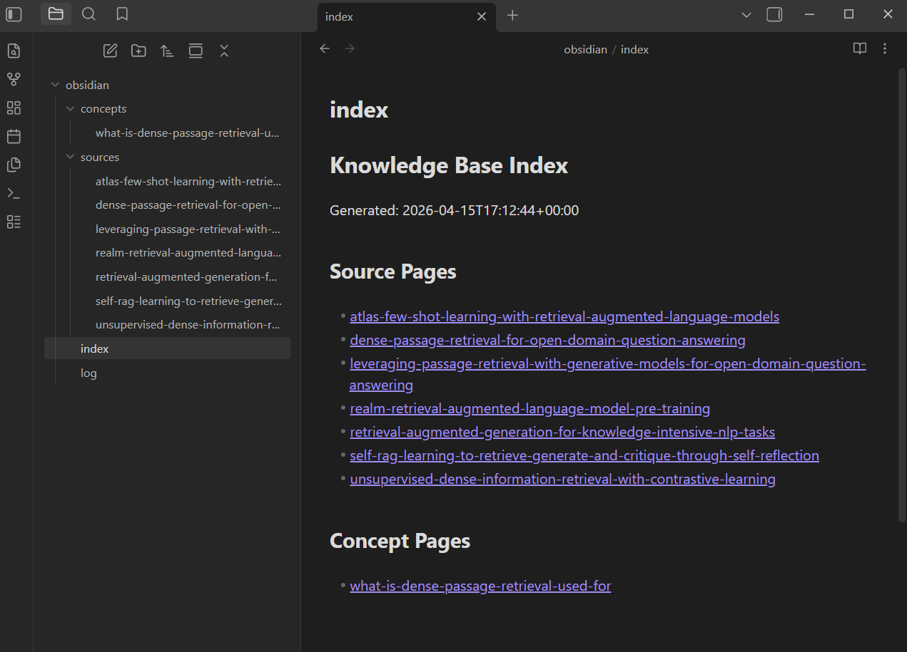
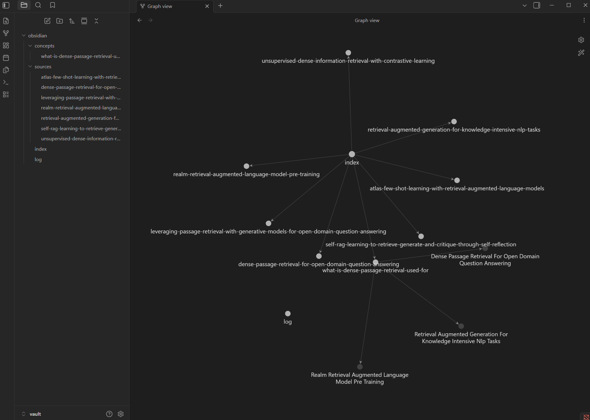

# Title: CLI for Building and Maintaining a Citation-Grounded Markdown Knowledge Base from Heterogeneous Technical Documents

Date: 04/18/2026

Team Member:

- Esteban Montelongo
- <EMONTEL1@depaul.edu>

Project Type: Individual project

The MVP is intentionally narrow in domain even though it is broader in input format. It targets a curated technical corpus about AI agents, coding agents, LLM tooling, and related knowledge-base system design. The system is intended to accept heterogeneous document types, but each source is first converted into a canonical markdown or plain-text representation before it enters the compile and query pipeline. For the MVP, evaluation will focus on text-heavy technical documents rather than source-code repositories or arbitrary structured datasets, because those require different parsing, compilation, and evaluation rules. The corpus itself will grow over time as the project progresses. At the proposal stage, the goal is not to commit to a final fixed list of documents, but to define the domain, supported input profile, normalization boundaries, and minimum evaluation target clearly enough that the project scope stays controlled while data collection continues.

## 1. Goals and Anticipated Outcomes

### Goals

The main goal of this project is to complete and evaluate a command-line application that builds and maintains a citation-grounded markdown knowledge base from a curated set of technical research documents. Instead of handling every incoming data type through a separate downstream workflow, the system will normalize each accepted document into a canonical markdown or plain-text form and then compile that normalized corpus into a structured wiki. The domain will remain narrow: AI agents, coding agents, LLM tooling, and related knowledge-base system design. The system will ingest those sources, compile source pages from the normalized text with explicit provenance plus provider-generated summaries, optionally synthesize cited concept pages from those compiled source pages, answer questions from the maintained knowledge base through a CLI, and export the result into an Obsidian-friendly vault.

The project also has a research goal. The central research question is whether a maintained markdown knowledge-base workflow built from normalized heterogeneous documents improves organization, traceability, freshness, and reuse of prior research when compared with simpler alternatives such as direct prompting over raw files and a basic vector-based RAG baseline. A secondary goal is to study whether a bounded, maintenance-first workflow can make LLM-assisted synthesis more trustworthy by tracking source provenance, recording which converter produced the canonical text, surfacing stale pages when sources change, and keeping deletion or archival under human control. A related learning goal is to understand where a maintained wiki workflow is actually stronger or weaker than simpler retrieval workflows: for example, whether it improves citation traceability and refresh behavior enough to justify the extra compilation step.

The project will be measured against concrete technical targets. The prototype should implement the current core CLI workflow, including initialization, ingest, compile, search, question answering, structural linting, semantic review, project-state inspection, and vault export. In the current command layout, that means commands such as `kb init`, `kb add` / `kb ingest`, `kb compile`, `kb query search`, `kb query ask`, `kb check lint`, `kb check review`, `kb show status`, `kb show diff`, and `kb export vault`. It should process a realistic sample corpus of at least 20 to 30 text-heavy technical documents by evaluation time, drawn from a representative mix of supported formats such as markdown, README or HTML-style docs, transcript text, PDFs, and born-digital office or notebook files that normalize cleanly. The full corpus may continue growing over the duration of the project, but the evaluation passes will use a frozen benchmark subset so results remain comparable over time. The system should maintain local searchable metadata, source hashes, and converter metadata, and generate a wiki that includes source pages, optional concept pages where useful, an index, and an activity log. It should also answer a benchmark set of 10 to 15 research questions using citations to compiled wiki pages, and it should detect when source changes make compiled pages stale or require review.

### Anticipated Outcomes

The anticipated outcomes are a working CLI prototype, a sample maintained knowledge base built from collected research materials, an Obsidian-friendly vault export, and an evaluation package showing where the maintenance-first markdown workflow is stronger or weaker than direct prompting and a simple RAG baseline. A successful result is not simply a working chatbot. A successful result is a repeatable workflow that accumulates research over time, keeps summaries and links current, flags outdated pages, and produces outputs that are useful for both study and final project reporting.

### Evaluation Plan

Evaluation will use functional, maintenance-oriented, and comparative measures. Functionally, all core commands must complete their intended workflows without manual file editing. Structurally, the compiled wiki should maintain valid links, current index data, explicit source citations, and clear traceability from raw source to generated page. Semantic review checks should surface potential contradictions and terminology drift across compiled pages. Those maintenance checks will remain deliberately lightweight: structural lint will expand through checklist-style markdown validation such as heading hierarchy, duplicate titles, valid link fragments, typed metadata fields, and empty-page detection, while semantic review will prioritize preferred-term normalization and candidate-based contradiction checks rather than exhaustive all-pairs reasoning. Conversion quality will be judged by spot-checking whether the normalized markdown or text preserves enough structure and content to support compilation and citation. On a benchmark set of 10 to 15 research questions, retrieval quality will be measured by whether at least one relevant source page appears in the top search results, and answer quality will be judged for correctness and completeness. Citation grounding will be measured by the proportion of answer claims and synthesized concept-page claims that remain traceable to cited source pages. Maintenance behavior will be tested with seeded source edits that record whether stale pages are detected and how much work is required to refresh the maintained wiki compared with rebuilding or rerunning the simpler baselines. Comparatively, the maintained wiki will be assessed against direct prompting over raw documents and a simple vector-based RAG workflow.

| Dimension | Measure | Target or comparison |
| --- | --- | --- |
| Workflow completion | Core commands run end to end on the sample corpus | All required workflows complete without manual file editing |
| Retrieval usefulness | Relevant source page appears in the top search results | Measured on 10 to 15 benchmark research questions |
| Citation grounding | Share of answers with verifiable citations to compiled pages | At least 80 percent |
| Maintenance freshness | Seeded source changes trigger stale or review flags | Affected pages are detected consistently |
| Comparative performance | Maintained wiki compared with direct prompting and basic vector RAG | Clear strengths, weaknesses, latency, and token-cost tradeoffs are documented |

The following criteria define success for the proposal:

- the core CLI workflows run end to end on the sample heterogeneous technical corpus;
- the system produces a navigable markdown wiki and Obsidian-friendly vault export;
- compiled pages maintain explicit source citations and provenance metadata;
- the normalization pipeline preserves enough content fidelity for compiled pages and cited answers to remain useful;
- benchmark retrieval logs show whether relevant source pages appear in the top results for the benchmark question set;
- selected source edits cause the system to flag affected pages as stale or needing review;
- semantic review checks flag potential contradictions or terminology drift across compiled pages;
- at least 80 percent of benchmark answers include verifiable citations to compiled pages; and
- the final evaluation clearly explains where the maintenance-first workflow improves on, matches, or falls short of direct prompting and a simple RAG baseline.

## 2. Motivation

The original motivation for this project comes from Andrej Karpathy's idea that LLMs can be used not only to answer questions, but also to maintain a persistent and compounding body of knowledge in markdown. That idea fits well with the way technical research is often collected in practice: README files, design notes, documentation pages, transcripts, exported notes, PDFs, and curated markdown notes accumulate over time, but they are rarely transformed into a maintainable, reusable knowledge artifact. This project addresses that gap by asking whether an LLM-assisted wiki can function as a better long-term research companion than one-off prompting or purely retrieval-driven pipelines for a narrow technical domain with heterogeneous source formats.

The project is also motivated by maintenance and traceability. Standard RAG workflows can retrieve relevant passages, but they still tend to emphasize transient question answering over persistent synthesis. They also do not naturally solve freshness problems when source documents change. In contrast, a maintained markdown wiki has the potential to preserve source context, concept relationships, historical updates, and review status in a form that is easier to inspect, audit, refresh, and reuse. For this project, the hard problem is not only generating pages once, but keeping those pages trustworthy over time.

Finally, the project is personally and professionally meaningful because it combines software engineering, evaluation, and a research workflow I could keep using after the course. Building a CLI-first application is a realistic but technically meaningful stretch goal, and the result could be useful beyond this course for students, researchers, and developers who need a structured way to transform a growing technical document collection into reusable knowledge rather than disconnected notes.

## 3. Resources and Feasibility

The most realistic implementation path is to build the prototype as a Python CLI using Click and Poetry. Browzy.ai will serve as the main reference for the raw-to-compile-to-query pipeline, markdown storage layout, incremental compilation, retrieval from compiled pages, and linting. OpenClaude will serve as the main reference for command registration, provider normalization, tool contracts, and the separation between setup, orchestration, and session state. In the proposed implementation, original files remain stored in the raw layer, but each document is normalized into canonical markdown or plain text before search, compilation, and query. The deterministic normalization path can route canonical markdown and plain text directly, use Docling for PDFs where layout fidelity matters more, and use MarkItDown for the remaining bounded born-digital formats that already contain a usable text layer. Provider-backed OCR remains a later fallback for scanned or image-only sources, with Mistral OCR as the current preferred future OCR option. If needed later, a provider-backed LLM cleanup or reconstruction step can sit behind that OCR path, but it should remain explicit rather than becoming the default ingest mode. The current prototype now uses SQLite FTS5 to index chunked compiled pages for lexical retrieval, and a small schema file such as `kb.schema.md` can steer compilation rules without turning the system into a large prompt-only application.

The project resources are realistic for an individual capstone. Development will use Python 3, Click, Poetry, Markdown files, Git, Obsidian-compatible markdown conventions, SQLite, pytest, Black, and GitHub Actions. The ingest path will also need format detection and per-type conversion into canonical markdown or text. Model access now flows through a deliberately small provider layer with OpenAI, Anthropic, and Gemini implementations, and a local Ollama model remains a viable fallback if cost or reliability becomes a constraint later. The dataset will be a curated corpus of text-heavy technical references on AI agents, coding agents, LLM tooling, and knowledge-base systems, stored in multiple supported source formats but normalized into a common internal representation. Direct prompting and a simple vector-based RAG workflow will serve as the main comparison baselines. A graph export or graph-oriented comparison, if attempted at all, will be treated as stretch work rather than core scope.

### Planned Input Data Profile

The exact corpus will not be fully fixed at proposal time because part of the project is to continue collecting and curating relevant research material as the work progresses. What is fixed now is the data profile, the domain boundary, and the evaluation target. The corpus will grow incrementally over time, while benchmark runs will be evaluated on explicitly frozen subsets so comparisons remain fair.

The intended input profile is a text-heavy technical corpus centered on AI agents, coding agents, LLM tooling, retrieval workflows, and related knowledge-base design. The expected source categories are:

- markdown notes, technical writeups, and documentation pages;
- README-style project documentation and structured web documentation exported as HTML or text;
- transcript-like or note-like technical text with looser structure;
- born-digital research PDFs and related papers; and
- selected born-digital office or notebook formats only when they normalize cleanly enough to support citation-grounded compilation.

This description is intentionally format- and domain-based rather than file-list-based. The central point of the project is not to analyze one static folder of documents, but to maintain a growing research corpus over time while preserving traceability, refresh behavior, and comparability on benchmark subsets. The primary capstone evaluation corpus will stay text-heavy. Image-only or scan-heavy documents may be discussed as a future OCR fallback case, but they will not define the core success criteria unless the deterministic converter path proves insufficient for an important source subset.

This scope is feasible because it does not attempt to reproduce either reference project in full, and it does not require every source format to be handled with a custom downstream workflow. The first version only needs a bounded set of source converters that normalize heterogeneous documents into a common markdown or text form, plus a small provider layer and a deterministic workflow for ingest, compile, search, query, lint, and export. That limitation keeps the capstone focused on the main research and engineering question while still leaving room for a meaningful comparison with simpler baselines.

### Backup Plans

If resources become limited, the scope can be reduced without breaking the central research question. If support for some source formats becomes too noisy, the prototype can freeze on the subset of formats that normalize cleanly enough for citation-grounded compilation. If cross-document concept pages become unreliable, the project can keep source pages as the primary artifact and reduce concept-page generation. If model cost or reliability becomes a constraint, the project can use a smaller evaluation corpus and rely more heavily on a local Ollama model. If comparison work expands beyond a manageable level, the graph track will be dropped completely and the project will focus on direct prompting plus a simple RAG baseline. If advanced reporting outputs become too time-consuming, the final deliverables will remain focused on the maintained wiki, cited query responses, maintenance findings, and the evaluation report.

## 4. Project Activities / Methods

The project will follow an explicit layered workflow rather than one large agent loop. The raw layer will store original source documents and a manifest of ingested sources. After type detection, each document will be normalized into a canonical markdown or plain-text form. The current deterministic implementation routes canonical markdown and plain text directly, uses Docling for PDFs, and uses MarkItDown for the remaining bounded born-digital subset before any OCR-specific path is introduced. A later provider-backed fallback can call Mistral OCR for scanned or image-heavy documents and, if needed, an explicit LLM cleanup step after OCR, but those paths should remain opt-in and traceable rather than replacing the default deterministic normalization flow. The manifest will record source path, ingest time, content hash, normalized artifact path, converter used, and related metadata so the system can later tell whether a compiled page may be stale or whether a conversion should be reviewed. The wiki layer will store generated source pages, concept pages where useful, an index, and an activity log. A vault layer will export Obsidian-friendly notes, backlinks, and frontmatter where useful. Inside the application code, the CLI will be split into commands, services, providers, tools, and shared types so that setup, ingestion, normalization, compilation, querying, linting, and export remain separate and testable.

The expected workflow is as follows. First, `kb add` or `kb ingest` will accept either a single file or a directory, recurse through directory inputs by default, detect source type, convert each supported document into canonical markdown or plain text, store the original files in `raw/`, store the normalized representations, update the manifest, and record searchable metadata plus a source hash. Second, `kb compile` will create or refresh source pages, regenerate the wiki index, refresh the SQLite search index, append to the activity log, and persist compile-run state so the most recent failed or interrupted compile can be resumed. Generated wiki artifacts, manifest updates, and vault-export files are written atomically so partial writes are less likely if a run is interrupted. In the current implementation, source pages keep deterministic provenance fields and excerpts from the normalized text while the summary field is generated by the configured provider. Optional concept pages, when enabled, are generated during compile from compiled source pages rather than directly from raw files, and those synthesized claims must retain citations back to the source pages used. Third, `kb query search` and `kb query ask` now retrieve ranked sections from compiled wiki pages through a SQLite FTS5 chunk index rather than scanning raw files directly, and `kb query ask` produces a cited provider-backed answer from that prepared context, optionally using self-consistency over a frozen evidence bundle with persisted run artifacts. The current implementation now carries chunk-level citation refs through that flow, so terminal citations and saved analysis pages can point at specific retrieved chunks rather than only whole pages. After displaying the answer, the command prompts the user to save it as a persistent analysis page so that useful query results can compound into the maintained knowledge base, and those saved analysis pages are then added back into the search index. Fourth, `kb check lint` will detect broken links, orphan pages, missing citations, stale pages whose sources changed, or structural gaps that require review. Fifth, `kb check review` will run semantic checks across compiled pages, surfacing potential contradictions and terminology drift; it now combines deterministic overlap checks with provider-backed review, and an adversarial mode persists typed findings to SQLite for later evaluation. Sixth, `kb show status` will summarize corpus size, compile state, conversion state, and maintenance findings. Seventh, `kb show diff` will show a pre-compile preview of which sources are new, changed, or already up to date. Finally, `kb export vault` will write an Obsidian-friendly vault view of the maintained knowledge base.

### Example Intermediate Artifacts

To make the workflow concrete in the final submitted proposal, I will include visual examples of intermediate artifacts rather than only describing the pipeline abstractly. The most useful examples are: a raw source document, the corresponding normalized markdown artifact, a compiled source page, and a generated concept page or vault-export note. Including those examples will make the pipeline auditable and demonstrate that the proposed workflow already exists beyond the whiteboard stage.

For the submitted proposal document, the most useful figures or screenshots are the following:

- one example raw input page or excerpt from a representative text or markdown source;
- one example raw HTML, documentation, or PDF source page from the intended corpus profile;
- one normalized markdown artifact showing what the converter preserves and what metadata is retained;
- one compiled source page showing provenance, citations, and summary structure; and
- one concept page or vault-export page showing how the maintained knowledge base becomes navigable over time.

### Obsidian Vault Screenshots

This subsection is reserved for screenshots taken from Obsidian after opening one of the generated vault views. The purpose of these images is to show that the maintained knowledge base is not only queryable from the CLI, but also browsable as a navigable markdown vault with index pages, source pages, concept pages, links, and backlinks.

For these screenshots, I used a small illustrative PDF evaluation corpus rather than the final capstone corpus. That example data consists of a focused set of related retrieval and retrieval-augmented generation papers used to validate the workflow on realistic born-digital PDFs. The raw PDF files served only as example source material to demonstrate ingest, normalization, compilation, and vault export, so the screenshots should be understood as evidence of the workflow and navigability of the system rather than as a claim that this small PDF slice is the final or complete project dataset.

- Figure 1. Obsidian file-explorer view of an exported example knowledge-base vault showing the index page, source pages, and concept pages.

- Figure 2. Example source page from the illustrative PDF evaluation set viewed in Obsidian Graph view, showing links to other source pages and concept pages.

The maintenance component will remain human-reviewed. For the MVP, maintenance means freshness detection, structural checks, semantic review checks, and a reviewable refresh workflow rather than full automatic contradiction resolution across the corpus. The `kb check lint` command handles deterministic structural checks while `kb check review` handles semantic analysis such as contradiction detection and terminology drift, keeping the two concerns cleanly separated. A planned `kb fix` command will close the loop by applying fixes in three tiers: deterministic fixes such as recompiling stale pages and regenerating missing frontmatter, light LLM-backed fixes for heading hierarchy, missing summaries, and term normalization shown as diffs for user confirmation, and harder fixes for contradiction resolution shown for human review but not auto-applied. This tiered approach keeps the system auditable while testing whether LLM-assisted maintenance improves wiki quality compared with manual fixes alone. Near-term improvements will stay conservative and auditable: `kb check lint` will grow through practical markdown and knowledge-base checks such as heading hierarchy, anchor validation, duplicate title detection, and typed frontmatter validation, while `kb check review` will use a small preferred-terms registry and candidate-based contradiction checks so terminology drift and likely conflicts can be surfaced without turning the project into a heavy ontology or full NLI research system. The system may flag a page as stale, outdated, or needing archival, but it will not silently delete knowledge. This keeps the workflow auditable and addresses the core maintenance concern in the project. The LLM-assisted component will also remain intentionally constrained. Instead of giving the model broad autonomy, the system will expose a small internal action layer for tasks such as updating concept pages, searching the wiki, and producing cited answers. This keeps model use explicit, bounded, and testable.

This is an individual project, so all responsibilities remain with one team member. I will be responsible for system design, implementation, testing, evaluation, documentation, and presentation preparation. Keeping the project individual supports a narrower and more defensible scope, which is more important for this capstone than maximizing feature breadth.

## 5. Work Plan / Timeline and Milestones

The work plan now matches the remaining course schedule and the current state of the project. The deterministic CLI foundation, provider layer, and bounded deliberation v1 implementation are already complete, so the remaining milestones focus on real-corpus evaluation, concept synthesis, maintenance validation, and final comparison. The milestones below align with the course update dates on 4/28, 5/12, 5/26, and the final presentation on 6/2.

| Phase | Target Time | Activities | Tangible Milestone |
| --- | --- | --- | --- |
| Implemented baseline (completed) | Completed by Apr 15 | Implement initialization, ingest, compile, search, query, lint, review, status, diff, export, normalization routing, manifest hashing, provider-backed compile/query/review, saved query analysis pages, self-consistency query, adversarial review, and SQLite run-artifact persistence | Working CLI with 10 commands, provider layer, bounded deliberation v1, and the current passing test suite |
| Proposal finalization | Apr 16 to Apr 18 | Incorporate feedback from the presentations, add concrete data examples, finalize the evaluation rubric, and submit the formal proposal document | Concrete proposal submitted |
| Project Update 1: curated corpus and initial real-corpus pass | Apr 19 to Apr 28 | Freeze the benchmark question set, continue expanding the broader corpus, define the first frozen evaluation subset, run initial self-consistency and adversarial review on real documents, and record latency, cost, and unsupported-claim artifacts | Update 1 shows first real-corpus evaluation results |
| Project Update 2: workflow tightening and comparative preparation | Apr 29 to May 12 | Add lightweight reporting helpers if manual inspection is too slow, inspect failure cases, improve search or retrieval if needed, and refine the baseline comparison workflow | Update 2 includes improved retrieval and a repeatable evaluation workflow |
| Project Update 3: concept synthesis and maintenance validation | May 13 to May 26 | Evaluate and improve concept-page generation and backlink maintenance on the real corpus, run stale-page and source-change tests, and measure refresh behavior | Update 3 demonstrates synthesis and maintenance validation |
| Final evaluation and presentation | May 27 to Jun 2 | Complete the direct-prompting versus RAG versus maintained-wiki comparison, polish the demo corpus, and finalize the report and presentation materials | Final presentation and capstone deliverables ready |

These milestones are measurable because each one corresponds to a concrete artifact or behavior: a working deterministic CLI foundation, a provenance-aware ingest pipeline, a generated wiki, a cited query workflow, a maintenance-validation report, an evaluation report, and a polished final demonstration.

If the core evaluation, synthesis, and comparison milestones are completed early, I may explore a lightweight secondary interface over the existing services, such as a small app or other non-CLI interface. That would be stretch scope only and is not part of the core success criteria for the capstone.

## 6. Bibliography

1. Karpathy, Andrej. "LLM Knowledge Bases Tweet." X, 2 Apr. 2026. [Tweet URL](https://x.com/karpathy/status/2039805659525644595). Accessed 5 Apr. 2026.
2. Karpathy, Andrej. "LLM Wiki." GitHub Gist, 2026. [Gist URL](https://gist.github.com/karpathy/442a6bf555914893e9891c11519de94f). Accessed 5 Apr. 2026.
3. Gitlawb. OpenClaude. 2026. Local workspace snapshot in [../../../Resources/openclaude/README.md](../../../Resources/openclaude/README.md). Accessed 5 Apr. 2026.
4. Kanukollu, Vihari. browzy.ai. 2026. [Repository](https://github.com/VihariKanukollu/browzy.ai). Accessed 5 Apr. 2026.
5. Pallets. Click Documentation. 2026. [Docs](https://click.palletsprojects.com/). Accessed 5 Apr. 2026.
6. Python Software Foundation. Python 3 Documentation. 2026. [Docs](https://docs.python.org/3/). Accessed 5 Apr. 2026.
7. SQLite Documentation. 2026. [Docs](https://www.sqlite.org/docs.html). Accessed 5 Apr. 2026.
8. Obsidian. Obsidian Help. 2026. [Docs](https://obsidian.md/help/). Accessed 5 Apr. 2026.
9. Rotenberg, Josh. "mdbook-lint Documentation: Standard Markdown Rules." 2026. [Docs](https://joshrotenberg.com/mdbook-lint/rules/standard/index.html). Accessed 14 Apr. 2026.
10. Tavian Dev. "mdlint." GitHub repository, 2026. [Repository](https://github.com/tavian-dev/mdlint). Accessed 14 Apr. 2026.
11. University of Pittsburgh Library System. "Metadata & Discovery @ Pitt: Taxonomies and Controlled Vocabularies." 2025. [Guide](https://pitt.libguides.com/metadatadiscovery/controlledvocabularies). Accessed 14 Apr. 2026.
12. Awaysheh, Abdullah, et al. "A Review of Medical Terminology Standards and Structured Reporting." Journal of Veterinary Diagnostic Investigation, 2017. [PMC](https://pmc.ncbi.nlm.nih.gov/articles/PMC6504145/). Accessed 14 Apr. 2026.
13. Gokul, Vignesh, Srikanth Tenneti, and Alwarappan Nakkiran. "Contradiction Detection in RAG Systems: Evaluating LLMs as Context Validators for Improved Information Consistency." arXiv:2504.00180, 2025. [Paper](https://arxiv.org/abs/2504.00180). Accessed 14 Apr. 2026.
14. Du, Yilun, Shuang Li, Antonio Torralba, Joshua B. Tenenbaum, and Igor Mordatch. "Improving Factuality and Reasoning in Language Models through Multiagent Debate." arXiv:2305.14325, 2023. [Paper](https://arxiv.org/abs/2305.14325). Accessed 14 Apr. 2026.
15. Wang, Xuezhi, Jason Wei, Dale Schuurmans, Quoc Le, Ed Chi, Sharan Narang, Aakanksha Chowdhery, and Denny Zhou. "Self-Consistency Improves Chain of Thought Reasoning in Language Models." arXiv:2203.11171, 2022. [Paper](https://arxiv.org/abs/2203.11171). Accessed 14 Apr. 2026.
16. Wang, Junlin, Jue Wang, Ben Athiwaratkun, Ce Zhang, and James Zou. "Mixture-of-Agents Enhances Large Language Model Capabilities." arXiv:2406.04692, 2024. [Paper](https://arxiv.org/abs/2406.04692). Accessed 14 Apr. 2026.
17. Agarwal, Shrestha, et al. "Do as We Do, Not as You Think: the Conformity of Large Language Models." arXiv:2501.13381, 2025. [Paper](https://arxiv.org/abs/2501.13381). Accessed 14 Apr. 2026.
18. "Debate or Vote: Which Yields Better Decisions in Multi-Agent Large Language Models?" OpenReview, 2025. [Paper](https://openreview.net/forum?id=iUjGNJzrF1). Accessed 14 Apr. 2026.
19. "If Multi-Agent Debate is the Answer, What is the Question?" arXiv:2502.08788, 2025. [Paper](https://arxiv.org/abs/2502.08788). Accessed 14 Apr. 2026.
20. Pydantic. "Models — Pydantic Documentation." 2026. [Docs](https://pydantic.dev/docs/validation/latest/concepts/models/). Accessed 14 Apr. 2026.
21. SQLite. "SQLite FTS5 Extension." 2026. [Docs](https://www.sqlite.org/fts5.html). Accessed 14 Apr. 2026.
22. Python Software Foundation. "Coroutines and Tasks — asyncio." Python 3 Documentation, 2026. [Docs](https://docs.python.org/3/library/asyncio-task.html). Accessed 14 Apr. 2026.
23. IBM Research. "Docling Documentation." 2026. [Docs](https://docling-project.github.io/docling/). Accessed 18 Apr. 2026.
24. Microsoft. "MarkItDown." GitHub repository, 2026. [Repository](https://github.com/microsoft/markitdown). Accessed 18 Apr. 2026.
25. Mistral AI. "Mistral OCR Documentation." 2026. [Docs](https://docs.mistral.ai/capabilities/document/). Accessed 18 Apr. 2026.
26. Command Line Interface Guidelines. "Command Line Interface Guidelines." 2026. [Guide](https://clig.dev/#introduction). Accessed 18 Apr. 2026.
